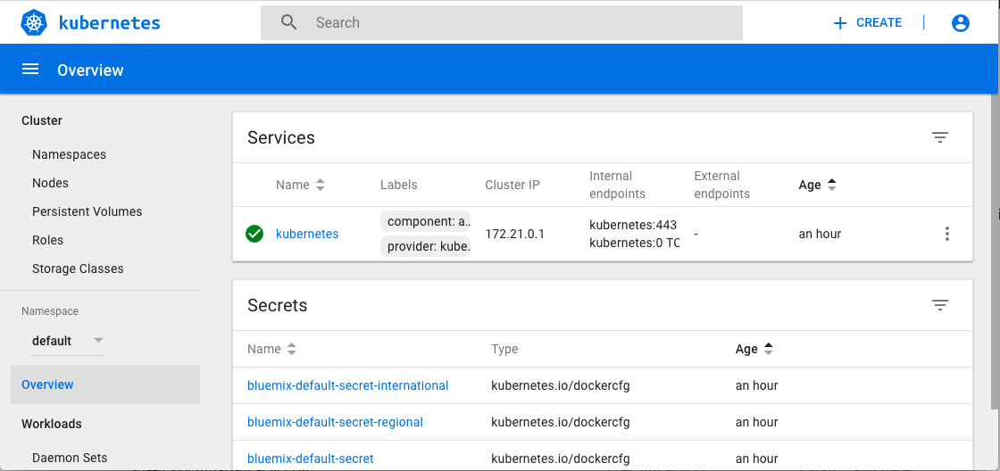
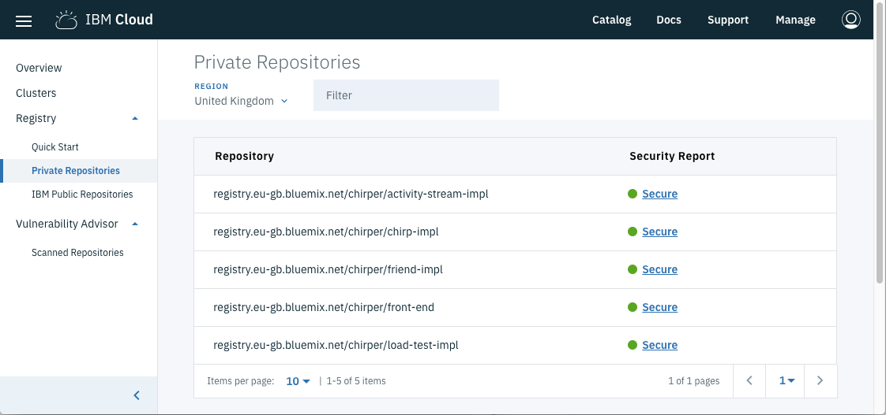
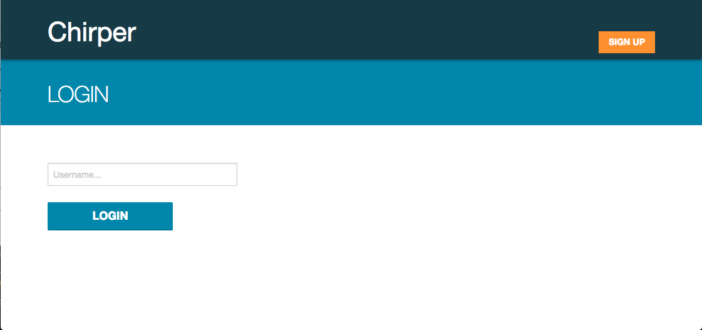

# Getting started with the Lightbend Orchestration for Kubernetes on the IBM Cloud

Lightbend describe their new [Lightbend Orchestration for Kubernetes](https://developer.lightbend.com/docs/lightbend-orchestration-kubernetes/latest/overview.html) as "... a developer-centric suite of tools that helps you deploy Reactive Platform applications to Kubernetes. It provides an easy way to create Docker images for your applications and introduces an automated process for generating Kubernetes resource files for you from those images."

As a Reactive Application developer you may choose to run Kubernetes on your development machine using Minikube. As your application grows and the number of microservices increases, you may choose to offload Kubernetes to a cloud-based solution. The Lightbend Orchestration for Kubernetes documentation points to [the IBM Cloud Container Service](https://developer.lightbend.com/docs/lightbend-orchestration-kubernetes/latest/cluster-setup.html) as an alternative to Minikube. In this article, I'll describe how to make that switch, while using [Chirper](https://github.com/longshorej/lagom-java-chirper-tooling-example), a Twitter-like [Lagom](https://www.lagomframework.com/) sample application, to showcase the Reactive Platform running on Kubernetes.

Kubernetes is fundamentally about orchestrating the Docker containers. Docker containers are created from Docker images and those are held in a Docker registry. When you build Docker images on your laptop they are stored locally. Minikube uses this local store to fetch images and create containers. When you run Docker containers in a remote Kubernetes cluster, a remote Docker registry is needed. IBM Cloud provides one of those in the [Container Registry](https://www.ibm.com/cloud/container-registry) and, as you'd expect, the Container Service (Kubernetes) and the Container Registry are well integrated.

## Register with IBM Cloud
To use the IBM Cloud Container Service you need an IBM Cloud account. If you don't already have one, [sign up for an IBMid and create your Lite (Free) account](https://console.bluemix.net/registration/free?). Then, to unlock your free Kubernetes cluster, you need to [provide some payment details](https://console.bluemix.net/account/billing).

If you want to use a pre-existing Lite account, then you will need to ensure you have [provided payment details](https://console.bluemix.net/account/billing), to unlock your free cluster.

Of course, [paid account options](https://www.ibm.com/cloud/pricing) also exist.

## Create your free cluster
IBM Cloud provides a single command line tool: `bx` for controlling the resources and services available to you. Using the Container Service, you can create a Kubernetes cluster through using `bx` but you may find it easier, at least the first time, to create your free cluster through the [web interface](https://console.bluemix.net/containers-kubernetes/clusters).

A short time after you've initiated the cluster creation, the web interface shows instructions for downloading the `bx` CLI, installing the container-service plugin into it, logging into your account ... all the way to configuring `kubectl` with the cluster and starting a local proxy to show the Kubernetes Dashboard for the cluster you've created. Like this:



## Somewhere to put Docker images
When you run you microservices on Kubernetes, Kubernetes deploys Docker containers made from Docker images which it retrieves from a Docker registry. Your IBM Cloud account has a private Docker registry associated with served up by the IBM Cloud Container Registry. To start with your private registry is empty.

The [Container Registry Quick Start](https://console.bluemix.net/containers-kubernetes/registry/start) gives instructions for installing the container-registry plugin to the `bx` CLI and how to create a namespace which can receive images pushed to it. This will come in useful later when we use Lightbend Orchestration for Kubernetes to push the Chirper application images to the registry.

## Developing Chirper with the IBM Cloud
You may have already followed [the instructions for setting up the Chirper example](https://github.com/longshorej/lagom-java-chirper-tooling-example/blob/master/README.md) which includes instructions specific to Minikube. The set of prequisites and steps are similar for deploying to IBM Cloud:

Install the following programs on your system:

* [Docker](https://store.docker.com/search?type=edition&offering=community)
* [Helm Client](https://github.com/kubernetes/helm/blob/master/docs/install.md#installing-the-helm-client)
* [SBT](http://www.scala-sbt.org/)
* [reactive-cli](https://developer.lightbend.com/docs/lightbend-orchestration-kubernetes/latest/cli-installation.html)

Set up the Reactive Sandbox instance of Cassandra in the Container Service:

The [Reactive Sandbox](https://github.com/lightbend/reactive-sandbox) includes development-grade (i.e. it will lose your data) installations of Cassandra, Elasticsearch, Kafka, and ZooKeeper. It's packaged as a Helm chart for easy installation into your Kubernetes cluster.

```bash
helm init --upgrade
helm repo add lightbend-helm-charts https://lightbend.github.io/helm-charts
helm update
```

Verify that Helm is available (this takes a minute or two):

```bash
kubectl --namespace kube-system get deploy/tiller-deploy
```

```
NAME            DESIRED   CURRENT   UP-TO-DATE   AVAILABLE   AGE
tiller-deploy   1         1         1            1           3m
```

Install the sandbox. Since Chirper only uses Cassandra, we're disabling the other services but you can leave them enabled by omitting the `set` flag if you wish.

```bash
helm install lightbend-helm-charts/reactive-sandbox --name reactive-sandbox --set elasticsearch.enabled=false,kafka.enabled=false,zookeeper.enabled=false
```

Verify that it is available (this takes a minute or two):

```bash
kubectl get deploy/reactive-sandbox
```

```
NAME               DESIRED   CURRENT   UP-TO-DATE   AVAILABLE   AGE
reactive-sandbox   1         1         1            1           1m
```

Now clone the Chirper sample referred to by the Lightbend Orchestration for Kubernetes project:

```
git clone https://github.com/longshorej/lagom-java-chirper-tooling-example.git chirper
cd chirper
```

Add a namespace to the Container Registry to hold the images the Chirper build process will create:

```
bx plugin install container-registry -r Bluemix
bx cr namespace-add chirper
```

If you were using Minikube you would invoke the 'sbt-native-packager' to create Docker images using `sbt docker:publishLocal`, but we're going to switch to publish to the Container Registry. For that we need to give `sbt` the registry location and namespace. You may already know the hostname of the Container Registry - there is one in each IBM Cloud region. It's the 'Container Registry' line output when you execute `bx cr info`.

For the namespace, we're going to use 'chirper'.

Add the following to the `build.sbt` file to the end of the definition of the `project` method around line 122:

```
  .settings(
    dockerRepository := Some("registry.eu-gb.bluemix.net/chirper")
  )
```

Note: I'm in the UK so my registry hostname has `eu-gb` in its name. Yours may differ.

Now, when you execute:

```
bx cr login
sbt docker:publish
```

the first command will redirect the local Docker engine to the Container Registry, and the second command will build the code and publish the images there.

You can check the images have uploaded by viewing the [IBM Cloud console page your private registry](https://console.bluemix.net/containers-kubernetes/registry/private). Which should look similar to:



### Akka Clusters that scale with Kubernetes Pods

Two of the Chirper services, friend-impl and chirp-impl make use of Akka Cluster. The [akka.io site describes an Akka Cluster](https://doc.akka.io/docs/akka/2.5.11/common/cluster.html) as providing:

"... a fault-tolerant decentralized peer-to-peer based cluster membership service with no single point of failure or single point of bottleneck. It does this using gossip protocols and an automatic failure detector."

There must be at least two members of an Akka Cluster to achieve the goal of 'no single point of failure'. Akka Cluster provides a way for each member member to discover each other member through a [gossip protocol](https://en.wikipedia.org/wiki/Gossip_protocol). A leader is determined, which is responsible for shifting members in and out of the cluster.

This maps nicely to Kubernetes. Each Akka Cluster member runs in a Kubernetes Pod. As Kubernetes scales the number of Pods up and down, Akka Cluster [notices this and adds and removes members appropriately](https://github.com/akka/akka-management/blob/master/docs/src/main/paradox/discovery.md#discovery-method-kubernetes-api). To do this, Pods containing Akka Cluster based services need to be able to watch other Pods coming and going. This is done using the Kubernetes API and requires a Kubernetes Role Based Access Control to be configured. The following will add a Kubernetes Role called 'pod-reader' and bind it to the service account running processes within Pods:

```
echo '
---
kind: Role
apiVersion: rbac.authorization.k8s.io/v1
metadata:
  name: pod-reader
rules:
- apiGroups: [""]
  resources: ["pods"]
  verbs: ["get", "watch", "list"]
---
kind: RoleBinding
apiVersion: rbac.authorization.k8s.io/v1
metadata:
  name: read-pods
subjects:
- kind: User
  name: system:serviceaccount:default:default
roleRef:
  kind: Role
  name: pod-reader
  apiGroup: rbac.authorization.k8s.io
' | kubectl apply -f -
```

### Deploy to Kubernetes
Now we're ready to direct Kubernetes to deploy the images and run the application.

You will need to run the following to set up your environment for the deploy. Be sure to adjust the secret variables and Container Registry host as necessary.

```
REGISTRY=registry.eu-gb.bluemix.net
NAMESPACE=chirper

# Be sure to change these secret values, or the services will not start.

chirp_secret="changeme"
friend_secret="changeme"
activity_stream_secret="changeme"
front_end_secret="changeme"

# Default address for reactive-sandbox, change if using external Cassandra

cassandra_svc="_cql._tcp.reactive-sandbox-cassandra.default.svc.cluster.local"

# Configure the services to allow requests to the Kubernetes IP (Play's Allowed Hosts Filter) For development purposes we'll allow all IPs.

allowed_host=.
```

There are four images necessary. For each image we'll use the Lightbend `rp` tool to generate the Kubernetes deployment YAML configuration and pipe that to the `kubectl` command to apply the configuration to Kubernetes. 

```
# deploy chirp-impl. Use two replicas which is the minimum for Akka Cluster based services.

rp generate-kubernetes-resources "$REGISTRY/$NAMESPACE/chirp-impl:1.0.0-SNAPSHOT" \
  --generate-pod-controllers --generate-services \
  --pod-controller-image-pull-policy Always \
  --env JAVA_OPTS="-Dplay.http.secret.key=$chirp_secret \
  -Dplay.filters.hosts.allowed.0=$allowed_host" \
  --external-service "cas_native=$cassandra_svc" --service-type NodePort \
  --pod-controller-replicas 2 | kubectl apply -f -


# deploy friend-impl. Use two replicas which is the minimum for Akka Cluster based services.

rp generate-kubernetes-resources "$REGISTRY/$NAMESPACE/friend-impl:1.0.0-SNAPSHOT" \
  --generate-pod-controllers --generate-services \
  --pod-controller-image-pull-policy Always \
  --env JAVA_OPTS="-Dplay.http.secret.key=$friend_secret \
  -Dplay.filters.hosts.allowed.0=$allowed_host" \
  --external-service "cas_native=$cassandra_svc" \
  --pod-controller-replicas 2 | kubectl apply -f -
  
# deploy activity-stream-impl

rp generate-kubernetes-resources "$REGISTRY/$NAMESPACE/activity-stream-impl:1.0.0-SNAPSHOT" \
  --generate-pod-controllers --generate-services \
  --pod-controller-image-pull-policy Always \
  --env JAVA_OPTS="-Dplay.http.secret.key=$activity_stream_secret \
  -Dplay.filters.hosts.allowed.0=$allowed_host" | kubectl apply -f -

# deploy front-end

rp generate-kubernetes-resources "$REGISTRY/$NAMESPACE/front-end:1.0.0-SNAPSHOT" \
  --generate-pod-controllers --generate-services \
  --pod-controller-image-pull-policy Always \
  --env JAVA_OPTS="-Dplay.http.secret.key=$front_end_secret \
  -Dplay.filters.hosts.allowed.0=$allowed_host" | kubectl apply -f -
```

Create the ingress definitions:

```
rp generate-kubernetes-resources \
  --generate-ingress --ingress-name chirper \
  "$REGISTRY/$NAMESPACE/chirp-impl:1.0.0-SNAPSHOT" \
  "$REGISTRY/$NAMESPACE/friend-impl:1.0.0-SNAPSHOT" \
  "$REGISTRY/$NAMESPACE/activity-stream-impl:1.0.0-SNAPSHOT" \
  "$REGISTRY/$NAMESPACE/front-end:1.0.0-SNAPSHOT" | kubectl apply -f -
```

You can view the results using:

```
kubectl describe ing
```

to get:

```
Name:             chirper
Namespace:        default
Address:          
Default backend:  default-http-backend:80 (<none>)
Rules:
  Host  Path  Backends
  ----  ----  --------
  *     
        /api/chirps/history   chirpservice:10000 (<none>)
        /api/chirps/live      chirpservice:10000 (<none>)
        /api/activity         activityservice:10000 (<none>)
        /api/users            friendservice:10000 (<none>)
        /                     front-end:10000 (<none>)
Annotations:
Events:  <none>
```

Now we need something to use the metadata to provide the ingress service. This is usually handled by the platform Kubernetes is running in such as IBM Cloud, but we have been setting up Chirper in a free cluster. The free cluster has a single node and as such, isn't provided with an [Ingress service](https://console.bluemix.net/docs/containers/cs_ingress.html#ingress):
> Ingress is available for standard clusters only and requires at least two worker nodes in the cluster to ensure high availability and that periodic updates are applied.

So we're going to set up nginx to be the ingress service. In this case Lightbend's Orchestration for Kubernetes provides an example YAML Kubernetes configuration:

```
kubectl apply -f https://developer.lightbend.com/docs/lightbend-orchestration-kubernetes/latest/files/example-nginx-controller.yaml
```

This deploys an 'ingress controller' to distribute the traffic to the correct endpoints and a 'default back end' to handle the URLs that aren't mapped. 

Nginx is running as a service within the Kubernetes cluster, and the Container Service has chosen which port to provide for http and https traffic. So we need to look up those ports:

```
kubectl get services
```

and look for the port mappings listed against the nginx-ingress service. For example

```
NAME                         TYPE           CLUSTER-IP       EXTERNAL-IP   PORT(S)                                           AGE
activityservice              ClusterIP      172.21.173.94    <none>        10000/TCP                                         18m
chirpservice                 NodePort       172.21.135.141   <none>        10000:30597/TCP,10001:31203/TCP,10002:30775/TCP   18m
friendservice                ClusterIP      172.21.179.173   <none>        10000/TCP,10001/TCP,10002/TCP                     18m
front-end                    ClusterIP      172.21.104.133   <none>        10000/TCP                                         18m
kubernetes                   ClusterIP      172.21.0.1       <none>        443/TCP                                           52m
nginx-default-backend        ClusterIP      172.21.57.24     <none>        80/TCP                                            2m
nginx-ingress                LoadBalancer   172.21.39.132    <pending>     80:32532/TCP,443:31139/TCP                        2m
reactive-sandbox-cassandra   ClusterIP      None             <none>        9042/TCP                                          30m
```

This indicates the internal port 80 (http) of nginx-ingress is mapped externally to 32532 and port 443 (https) is mapped externally to 31139. Yours will be different.

To determine the public IP address use the following command:

```
bx cs workers mycluster
```

The URL to the Chirper application will be at the https port on this IP address. Use:

```
https://<public ip address>:<external https port>/
```

in a browser, and after accepting the security credentials as ok, you should see:



### Developing to the cloud
By following the steps above you've seen how to start developing applications for the Reactive Platform to run on the IBM Cloud in Docker containers orchestrated by Kubernetes.
